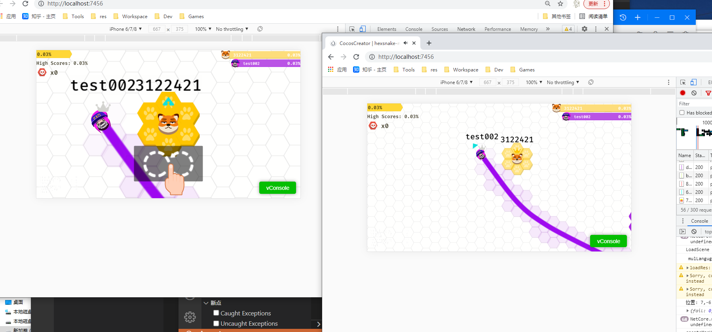

# Hexsnake2 - Networking

#### Introduction
Websocket-based frame synchronization demo

#### In-game screenshots

#### Operating Environment
Server： node.js
Client:  cocos creator 2.2

#### Instructions for use
Please consume at your discretion !!! 