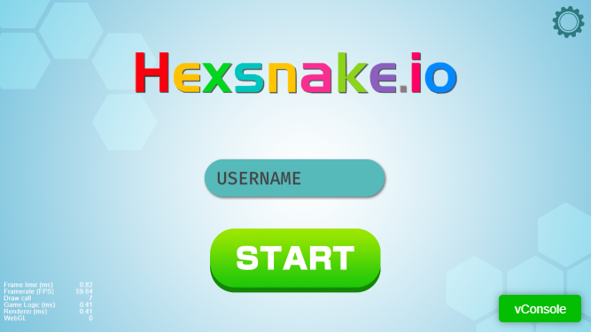

# 仿 圈地游戏 扩展网络版本

#### 介绍
主要用于websocket 帧同步学习及应用

#### 游戏内截图

#### 运行环境
服务端： node.js
客户端:  cocos creator 2.2

#### 文档
客户端: https://eeb5kqsx4g.feishu.cn/mindnotes/bmncnzOsxcSpOtiaqjg9Uhi94Ac#mindmap

服务器: https://eeb5kqsx4g.feishu.cn/mindnotes/bmncn0y13jpXDJSq220rlO3aNAc#mindmap

#### 使用说明
请酌情食用
